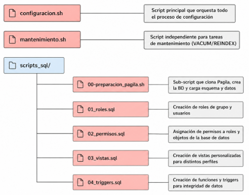

# AUTOMATIZACIÓN, SEGURIDAD E INTEGRIDAD EN POSTGRESQL (PAGILA) 

---

En esta práctica vamos a simular que se nos contrata para modernizar el sistema de base de datos de una empresa de alquiler de películas. Dicha empresa despliega su base de datos de forma manual, no tiene ningún tipo de control de accesos y aún menos seguridad.  

Se nos contrata como encargados de poner remedio a estos problemas; crear un sistema de automatización que permita levantar el entorno desde 0, configurar la seguridad y establecer rutinas de mantenimiento e integridad de los datos.

Es por ello que el primer paso en esta práctica va a ser el de la descarga y puesta en marcha del servicio de PostgreSQL, el sistema que usa la empresa para su base de datos.

---

## INSTALACIÓN DE POSTGRESQL

---

Para hacer la instalación de PostgreSQL-18 (servidor) seguiremos los pasos de nuestra propia guía previa: https://github.com/mvm-classroom/install-postgresql-18-a-un-ubuntu-server-24-04-aguilera-joel 

---

## PREPARACIÓN DE LA ESTRUCTURA DE LA PRÁCTICA

---

Ahora vamos a organizar la estructura de la práctica haciendo la creación de los ficheros que necesitaremos más adelante…

Crearemos el siguiente directorio y los siguientes ficheros de scripts (por ahora vacíos) dentro.

```bash
joel@joelauto:~$ mkdir -p ~/pagila_practica/scripts_sql
joel@joelauto:~$ cd ~/pagila_practica
joel@joelauto:~/pagila_practica$ touch configuracion.sh mantenimiento.sh
joel@joelauto:~/pagila_practica$ touch scripts_sql/00_preparacion_pagila.sh
joel@joelauto:~/pagila_practica$ touch scripts_sql/01_roles.sql
joel@joelauto:~/pagila_practica$ touch scripts_sql/02_permisos.sql
joel@joelauto:~/pagila_practica$ touch scripts_sql/03_vistas.sql
joel@joelauto:~/pagila_practica$ touch scripts_sql/04_triggers.sql
```

Para entenderlo de una manera más visual y clara, quedaría una estructura como la de la siguiente imagen:




Ahora, tal y como pide el enunciado, vamos a hacer que el usuario **postgres** no nos pida la contraseña de forma interactiva. Por ello, PostgreSQL trabaja con un fichero **.pgpass** precisamente para que no nos pida la contraseña y la coja automáticamente del fichero.

Crearemos el fichero:

```bash
joel@joelauto:~/pagila_practica$ nano ~/.pgpass
```

Y dentro pondremos una línea con el siguiente formato:

```bash
localhost:5432:*:postgres:joe_pagila
```

Guardamos y le otorgamos los privilegios necesarios.

```bash
joel@joelauto:~/pagila_practica$ chmod 600 ~/.pgpass
```

De esta manera le estamos diciendo a psql que use la contraseña que hemos especificado en el fichero, cuando el script se conecte como cliente **postgres**.

A continuación vamos a comprobar que postgres tiene la contraseña que hemos puesto en el fichero y luego la conexión TCP, que es la que usará el fichero.

```bash
joel@joelauto:~$ sudo -u postgres psql -c "ALTER USER postgres WITH PASSWORD 'joe_pagila';"
[sudo] contraseña para joel: 
ALTER ROLE
```
```bash
joel@joelauto:~$ psql -h localhost -U postgres -d postgres -c "SELECT current_user;"
 current_user 
--------------
 postgres
(1 fila)
```

---

## PREPARACIÓN DEL SCRIPT 00_PREPARACION_PAGILA.SH

---

Una vez ya tenemos la instalación hecha y la estructura clara y organizada, vamos a ponernos con el script **00_preparacion_pagila.sh**. Este será el script encargado de clonar el repositorio oficial de Pagila, en el caso de que ya existieran, borrar la copia anterior y la base de datos pagila, y crear la base de datos y cargar el esquema y los datos.

```bash
joel@joelauto:~/pagila_practica$ nano scripts_sql/00_preparacion_pagila.sh
```

Su contenido será el siguiente (explicado con las diferentes funciones principales):

```bash
#!/bin/bash

# El script se detiene automáticamente si un comando falla.
set -e

# Variables principales
DB_NAME="pagila"
DB_USER="postgres"
DB_HOST="localhost"
REPO_URL="https://github.com/devrimgunduz/pagila.git"
REPO_DIR="pagila"

echo "========================================"
echo " FASE 0 - Preparación de Pagila"
echo "========================================"

echo "[1/5] Eliminando repositorio anterior si existe..."
rm -rf "$REPO_DIR"

echo "[2/5] Clonando repositorio oficial de Pagila..."
git clone "$REPO_URL"

echo "[3/5] Recreando base de datos $DB_NAME..."
psql -h "$DB_HOST" -U "$DB_USER" -d postgres -v ON_ERROR_STOP=1 <<SQL
SELECT pg_terminate_backend(pid)
FROM pg_stat_activity
WHERE datname = '$DB_NAME'
  AND pid <> pg_backend_pid();

DROP DATABASE IF EXISTS $DB_NAME;
CREATE DATABASE $DB_NAME;
SQL

# ON_ERROR_STOP=1 -> Si alguna sentencia SQL falla, para la ejecución y devuelve error.
# <<SQL -> Eso se llama heredoc y sirve para meter varias líneas SQL directamente dentro del script Bash, sin tener que crear otro archivo aparte.

echo "[4/5] Cargando esquema de Pagila..."
psql -h "$DB_HOST" -U "$DB_USER" -d "$DB_NAME" -v ON_ERROR_STOP=1 -f "$REPO_DIR/pagila-schema.sql"

echo "[5/5] Cargando datos de Pagila..."
psql -h "$DB_HOST" -U "$DB_USER" -d "$DB_NAME" -v ON_ERROR_STOP=1 -f "$REPO_DIR/pagila-insert-data.sql"

echo "========================================"
echo " Pagila preparada correctamente"
echo "========================================"
```

Ahora le daremos permisos de ejecución.

```bash
joel@joelauto:~/pagila_practica$ chmod +x scripts_sql/00_preparacion_pagila.sh
```

Y lo ejecutaremos para comprobar que funciona correctamente.

```bash
joel@joelauto:~/pagila_practica$ chmod +x scripts_sql/00_preparacion_pagila.sh
joel@joelauto:~/pagila_practica$ ./scripts_sql/00_preparacion_pagila.sh
========================================
 FASE 0 - Preparación de Pagila
========================================
[1/5] Eliminando repositorio anterior si existe...
[2/5] Clonando repositorio oficial de Pagila...
./scripts_sql/00_preparacion_pagila.sh: línea 21: git: orden no encontrada
joel@joelauto:~/pagila_practica$  
```
> > [!WARNING]
> Vemos que falla porque en la línea 21 le damos la orden **git** y no la tenemos instalada. Así que la instalaremos con el siguiente comando:

```bash
joel@joelauto:~/pagila_practica$  sudo apt install -y git
[sudo] contraseña para joel: 
Leyendo lista de paquetes... Hecho
Creando árbol de dependencias... Hecho
Leyendo la información de estado... Hecho
```

Como de costumbre comprobamos la versión instalada para confirmar que se ha instalado con éxito.

```bash
joel@joelauto:~/pagila_practica$ git --version
git version 2.43.0
```

Y volvemos a ejecutar el script para verificar que funciona.

```bash
joel@joelauto:~/pagila_practica$ ./scripts_sql/00_preparacion_pagila.sh
========================================
 FASE 0 - Preparación de Pagila
========================================
[1/5] Eliminando repositorio anterior si existe...
[2/5] Clonando repositorio oficial de Pagila…
…
(1 fila)

 setval 
--------
      2
(1 fila)

========================================
 Pagila preparada correctamente
========================================
```

> [!NOTE]
> Paciencia. Tardará un buen rato en devolver el resultado.

Pero una vez terminado de ejecutar, tal y como lo hemos configurado con el "echo final" nos deja el mensaje conforme se ha preparado con éxito.

Ahora verificaremos manualmente que se han cargado las tablas con los registros.

```bash
joel@joelauto:~/pagila_practica$ psql -h localhost -U postgres -d pagila -c "\dt"
                     Listado de tablas
 Esquema |      Nombre      |        Tipo        |  Dueño   
---------+------------------+--------------------+----------
 public  | actor            | tabla              | postgres
 public  | address          | tabla              | postgres
 public  | category         | tabla              | postgres
 public  | city             | tabla              | postgres
 public  | country          | tabla              | postgres
 public  | customer         | tabla              | postgres
 public  | film             | tabla              | postgres
 public  | film_actor       | tabla              | postgres
 public  | film_category    | tabla              | postgres
 public  | inventory        | tabla              | postgres
 public  | language         | tabla              | postgres
 public  | payment          | tabla particionada | postgres
 public  | payment_p2022_01 | tabla              | postgres
 public  | payment_p2022_02 | tabla              | postgres
 public  | payment_p2022_03 | tabla              | postgres
 public  | payment_p2022_04 | tabla              | postgres
 public  | payment_p2022_05 | tabla              | postgres
 public  | payment_p2022_06 | tabla              | postgres
 public  | payment_p2022_07 | tabla              | postgres
 public  | rental           | tabla              | postgres
 public  | staff            | tabla              | postgres
 public  | store            | tabla              | postgres
(22 filas)
```

---

## PREPARACIÓN DEL SCRIPT CONFIGURACION.SH

---

A continuación vamos a crear el script orquestador, que ejecutará la preparación de Pagila (es decir, el primer script **00_preparacion_pagila.sh**) y luego lanzará los demás scripts SQL de manera ordenada (roles, permisos, vistas y triggers), dejándolo todo guardado en un log llamado **configuracion_pagila.log**.

```bash
joel@joelauto:~/pagila_practica$ nano configuracion.sh
```

Su contenido será el siguiente:

```bash
#!/bin/bash

# Controla los errores normales.
set -e

# Si el comando de una tubería (|) falla, el script también fallará.
set -o pipefail

# Variables principales
LOG_FILE="configuracion_pagila.log"
DB_NAME="pagila"
DB_USER="postgres"
DB_HOST="localhost"
SQL_DIR="scripts_sql"

# Colores para que la salida sea más clara
GREEN="\e[32m"
BLUE="\e[34m"
RED="\e[31m"
RESET="\e[0m"

# Todo lo que se muestre por pantalla también se guardará en el log
exec > >(tee "$LOG_FILE") 2>&1

echo -e "${BLUE}========================================${RESET}"
echo -e "${BLUE} CONFIGURACIÓN COMPLETA DE PAGILA${RESET}"
echo -e "${BLUE}========================================${RESET}"
echo "Fecha de ejecución: $(date)"
echo ""

echo -e "${GREEN}[1/5] Preparando base de datos Pagila...${RESET}"
# Este script clona el repositorio oficial, crea la base de datos y carga esquema + datos.
bash "$SQL_DIR/00_preparacion_pagila.sh"

echo -e "${GREEN}[2/5] Creando roles y usuarios...${RESET}"
# Ejecuta la creación de usuarios y roles de grupo.
psql -h "$DB_HOST" -U "$DB_USER" -d "$DB_NAME" -v ON_ERROR_STOP=1 -f "$SQL_DIR/01_roles.sql"

echo -e "${GREEN}[3/5] Aplicando permisos...${RESET}"
# Aplica permisos concretos sobre tablas importantes.
psql -h "$DB_HOST" -U "$DB_USER" -d "$DB_NAME" -v ON_ERROR_STOP=1 -f "$SQL_DIR/02_permisos.sql"

echo -e "${GREEN}[4/5] Creando vistas personalizadas...${RESET}"
# Crea vistas para mostrar solo la información necesaria a cada perfil.
psql -h "$DB_HOST" -U "$DB_USER" -d "$DB_NAME" -v ON_ERROR_STOP=1 -f "$SQL_DIR/03_vistas.sql"

echo -e "${GREEN}[5/5] Creando triggers de integridad...${RESET}"
# Crea funciones y triggers para controlar reglas de negocio.
psql -h "$DB_HOST" -U "$DB_USER" -d "$DB_NAME" -v ON_ERROR_STOP=1 -f "$SQL_DIR/04_triggers.sql"

echo ""
echo -e "${BLUE}========================================${RESET}"
echo -e "${GREEN} CONFIGURACIÓN FINALIZADA CORRECTAMENTE${RESET}"
echo -e "${BLUE}========================================${RESET}"
echo "Log generado en: $LOG_FILE"
```

Y como al anterior, le daremos los permisos necesarios.

```bash
joel@joelauto:~/pagila_practica$ chmod +x configuracion.sh
```

A diferencia del anterior, este aún no lo ejecutaremos porque aún no tenemos listos los scripts SQL.

---

## PREPARACIÓN DEL SCRIPT 01_ROLES.SQL

---

Seguimos con la creación del script **01_roles.sql**, en el que vamos a separar los usuarios reales y roles de grupo, creando así la estructura de seguridad.

En resumen lo que hará este script será crear dos roles de grupo; **grupo_gerencia** y **grupo_atencion**. Junto con dos usuarios reales; **manager_user** y **staff_user**.

De esta forma no habrá que darle los permisos a cada usuario por separado, y si por ejemplo entrara un nuevo empleado, habría que meterlo en el grupo adecuado y no darle unos permisos específicos.


```bash
joel@joelauto:~/pagila_practica$ nano scripts_sql/01_roles.sql
```

Y su contenido será:

```bash
-- ==========================================================
-- 01_roles.sql
-- Creación de roles de grupo y usuarios para Pagila
-- ==========================================================

-- Primero eliminamos los usuarios si ya existen. Esto permite repetir la práctica varias veces sin errores.
DROP ROLE IF EXISTS manager_user;
DROP ROLE IF EXISTS staff_user;

-- Eliminamos los roles de grupo si ya existen.
DROP ROLE IF EXISTS grupo_gerencia;
DROP ROLE IF EXISTS grupo_atencion;

-- Creamos roles de grupo.
-- Estos roles no tienen LOGIN porque no son usuarios reales, solo sirven para agrupar permisos.
CREATE ROLE grupo_gerencia;
CREATE ROLE grupo_atencion;

-- Creamos usuarios reales con LOGIN.
-- Estos usuarios serán los que podrían conectarse a la base de datos.
CREATE ROLE manager_user WITH
    LOGIN
    PASSWORD 'Manager_Pagila';

CREATE ROLE staff_user WITH
    LOGIN
    PASSWORD 'Staff_Pagila';

-- Asignamos los usuarios a sus grupos.
-- Así los permisos se darán a los grupos, no directamente a cada usuario.
GRANT grupo_gerencia TO manager_user;
GRANT grupo_atencion TO staff_user;

-- Dejamos una salida visible para confirmar que el script ha terminado.
DO $$
BEGIN
    RAISE NOTICE 'Roles de grupo y usuarios creados correctamente.';
END;
$$;
```

Lo probaremos con…

```bash
joel@joelauto:~/pagila_practica$ psql -h localhost -U postgres -d pagila -v ON_ERROR_STOP=1 -f scripts_sql/01_roles.sql
psql:scripts_sql/01_roles.sql:8: NOTICE:  el rol «manager_user» no existe, omitiendo
DROP ROLE
psql:scripts_sql/01_roles.sql:9: NOTICE:  el rol «staff_user» no existe, omitiendo
DROP ROLE
psql:scripts_sql/01_roles.sql:12: NOTICE:  el rol «grupo_gerencia» no existe, omitiendo
DROP ROLE
psql:scripts_sql/01_roles.sql:13: NOTICE:  el rol «grupo_atencion» no existe, omitiendo
DROP ROLE
CREATE ROLE
CREATE ROLE
CREATE ROLE
CREATE ROLE
GRANT ROLE
GRANT ROLE
psql:scripts_sql/01_roles.sql:41: NOTICE:  Roles de grupo y usuarios creados correctamente.
DO
```

Y comprobaremos los roles existentes con…

```bash
joel@joelauto:~/pagila_practica$ psql -h localhost -U postgres -d pagila -c "\du"
                              Listado de roles
 Nombre de rol  |                         Atributos                          
----------------+------------------------------------------------------------
 grupo_atencion | No puede conectarse
 grupo_gerencia | No puede conectarse
 manager_user   | 
 postgres       | Superusuario, Crear rol, Crear BD, Replicación, Ignora RLS
 staff_user     | 
```

---

## PREPARACIÓN DEL SCRIPT 02_PERMISOS.SQL

---

Acto seguido, iremos con el siguiente script **02_permisos.sql**, que dará permisos a los grupos en los que habremos clasificado a los usuarios, para de nuevo no tener que administrar usuario a usuario los permisos.

Vamos con su creación.

```bash
joel@joelauto:~/pagila_practica$ nano scripts_sql/02_permisos.sql
```

Y su contenido final.

```bash
-- ==========================================================
-- 02_permisos.sql
-- Asignación de permisos sobre la base de datos Pagila
-- ==========================================================

-- Damos permiso de conexión a la base de datos.
GRANT CONNECT ON DATABASE pagila TO grupo_gerencia;
GRANT CONNECT ON DATABASE pagila TO grupo_atencion;

-- Damos permiso de uso sobre el esquema public.
-- Sin esto, los roles no podrían acceder correctamente a los objetos del esquema.
GRANT USAGE ON SCHEMA public TO grupo_gerencia;
GRANT USAGE ON SCHEMA public TO grupo_atencion;

-- ----------------------------------------------------------
-- Permisos para gerencia
-- ----------------------------------------------------------
-- Gerencia puede consultar información general de negocio.
GRANT SELECT ON TABLE film TO grupo_gerencia;
GRANT SELECT ON TABLE inventory TO grupo_gerencia;
GRANT SELECT ON TABLE rental TO grupo_gerencia;
GRANT SELECT ON TABLE customer TO grupo_gerencia;
GRANT SELECT ON TABLE payment TO grupo_gerencia;

-- Gerencia también puede modificar datos clave de inventario y películas.
GRANT INSERT, UPDATE ON TABLE film TO grupo_gerencia;
GRANT INSERT, UPDATE ON TABLE inventory TO grupo_gerencia;

-- ----------------------------------------------------------
-- Permisos para atención al cliente / recepción
-- ----------------------------------------------------------
-- El personal de atención puede consultar películas e inventario.
GRANT SELECT ON TABLE film TO grupo_atencion;
GRANT SELECT ON TABLE inventory TO grupo_atencion;

-- También puede gestionar alquileres, ya que forma parte de su trabajo diario.
GRANT SELECT, INSERT, UPDATE ON TABLE rental TO grupo_atencion;

-- Puede consultar clientes, pero no modificar pagos ni información económica.
GRANT SELECT ON TABLE customer TO grupo_atencion;

-- No se conceden permisos sobre payment al grupo de atención para evitar acceso a información sensible de pagos.

DO $$
BEGIN
    RAISE NOTICE 'Permisos aplicados correctamente a los grupos.';
END;
$$;
```

De esta forma el **grupo_gerencia** tiene más permisos porque necesita consultar datos de negocios y gestionar inventario, mientras que **grupo_atencion** solo tiene los permisos necesarios para recepción, consultar pelis, inventario, clientes y gestionar los alquileres.

Y como hemos hecho con los anteriores, vamos a probarlo y a revisar los permisos de algunas tablas clave.

```bash
joel@joelauto:~/pagila_practica$ psql -h localhost -U postgres -d pagila -v ON_ERROR_STOP=1 -f scripts_sql/02_permisos.sql
GRANT
GRANT
GRANT
GRANT
GRANT
GRANT
GRANT
GRANT
GRANT
GRANT
GRANT
GRANT
GRANT
GRANT
GRANT
psql:scripts_sql/02_permisos.sql:49: NOTICE:  Permisos aplicados correctamente a los grupos.
DO
```

```bash
joel@joelauto:~/pagila_practica$ psql -h localhost -U postgres -d pagila -c "\dp film"

                                              Privilegios
 Esquema | Nombre | Tipo  |         Privilegios         | Privilegios de acceso a columnas | Políticas 
---------+--------+-------+-----------------------------+----------------------------------+-----------
 public  | film   | tabla | postgres=arwdDxtm/postgres +|                                  | 
         |        |       | grupo_gerencia=arw/postgres+|                                  | 
         |        |       | grupo_atencion=r/postgres   |                                  | 
```

```bash
joel@joelauto:~/pagila_practica$ psql -h localhost -U postgres -d pagila -c "\dp rental"

                                              Privilegios
 Esquema | Nombre | Tipo  |         Privilegios         | Privilegios de acceso a columnas | Políticas 
---------+--------+-------+-----------------------------+----------------------------------+-----------
 public  | rental | tabla | postgres=arwdDxtm/postgres +|                                  | 
         |        |       | grupo_gerencia=r/postgres  +|                                  | 
         |        |       | grupo_atencion=arw/postgres |                                  | 
(1 fila)
```

```bash
joel@joelauto:~/pagila_practica$ psql -h localhost -U postgres -d pagila -c "\dp payment"


                                                    Privilegios
 Esquema | Nombre  |        Tipo        |        Privilegios         | Privilegios de acceso a columnas | Políticas 
---------+---------+--------------------+----------------------------+----------------------------------+-----------
 public  | payment | tabla particionada | postgres=arwdDxtm/postgres+|                                  | 
         |         |                    | grupo_gerencia=r/postgres  |                                  | 
(1 fila)
```

Y en esta última tabla, a diferencia de las otras dos, se demuestra que solo tienen permisos aquellos usuarios que son del **grupo_gerencia**.

---

## PREPARACIÓN DEL SCRIPT 03_VISTAS.SQL

---

Después del anterior, vamos con el script **03_vistas.sql**

Este script sirve para crear una vista llamada **vista_peliculas_disponibles** que le permite al grupo de atención ver las clasificaciones de las pelis, los títulos, las copias totales y las disponibles, evitando mostrar datos importantes.

```bash
joel@joelauto:~/pagila_practica$ nano scripts_sql/03_vistas.sql
```

Y su contenido será...

```bash
-- ==========================================================
-- 03_vistas.sql
-- Creación de vistas personalizadas para Pagila
-- ==========================================================

-- Eliminamos la vista si ya existe para poder repetir la práctica.
DROP VIEW IF EXISTS vista_peliculas_disponibles;

-- Esta vista está pensada para el personal de atención.
-- Muestra información útil para recepción, pero evita los datos sensibles como pagos, ingresos o información interna de la empresa.
CREATE VIEW vista_peliculas_disponibles AS
SELECT
    f.film_id,
    f.title AS titulo,
    f.rating AS clasificacion,
    COUNT(i.inventory_id) AS copias_totales,
    COUNT(i.inventory_id) FILTER (
        WHERE i.inventory_id NOT IN (
            SELECT r.inventory_id
            FROM rental r
            WHERE r.return_date IS NULL
        )
    ) AS copias_disponibles
FROM film f
JOIN inventory i ON f.film_id = i.film_id
GROUP BY f.film_id, f.title, f.rating
ORDER BY f.title;

-- Damos permiso de consulta de la vista al grupo de atención.
GRANT SELECT ON vista_peliculas_disponibles TO grupo_atencion;

-- También permitimos que gerencia pueda consultarla.
GRANT SELECT ON vista_peliculas_disponibles TO grupo_gerencia;

DO $$
BEGIN
    RAISE NOTICE 'Vista de películas disponibles creada correctamente.';
END;
$$;
```

Y como hemos hecho con los anteriores, vamos a probarlo y a revisar los permisos de algunas tablas clave.

```bash
joel@joelauto:~/pagila_practica$ psql -h localhost -U postgres -d pagila -v ON_ERROR_STOP=1 -f scripts_sql/03_vistas.sql
psql:scripts_sql/03_vistas.sql:7: NOTICE:  la vista «vista_peliculas_disponibles» no existe, omitiendo
DROP VIEW
CREATE VIEW
GRANT
GRANT
psql:scripts_sql/03_vistas.sql:40: NOTICE:  Vista de películas disponibles creada correctamente.
DO
```

Ahora probamos que funcione.

```bash
joel@joelauto:~/pagila_practica$ psql -h localhost -U postgres -d pagila -c "SELECT * FROM vista_peliculas_disponibles LIMIT 5;"

film_id |      titulo      | clasificacion | copias_totales | copias_disponibles 
---------+------------------+---------------+----------------+--------------------
       1 | ACADEMY DINOSAUR | PG            |              8 |                  7
       2 | ACE GOLDFINGER   | G             |              3 |                  2
       3 | ADAPTATION HOLES | NC-17         |              4 |                  4
       4 | AFFAIR PREJUDICE | G             |              7 |                  6
       5 | AFRICAN EGG      | G             |              3 |                  2
(5 filas)
```

Y probaremos los permisos con el usuario de atención al cliente **staff_pagila** con la contraseña que le hemos asignado antes.

```bash
joel@joelauto:~/pagila_practica$ psql -h localhost -U staff_user -d pagila -c "SELECT * FROM vista_peliculas_disponibles LIMIT 5;"
Contraseña para usuario staff_user: 


film_id |      titulo      | clasificacion | copias_totales | copias_disponibles 
---------+------------------+---------------+----------------+--------------------
       1 | ACADEMY DINOSAUR | PG            |              8 |                  7
       2 | ACE GOLDFINGER   | G             |              3 |                  2
       3 | ADAPTATION HOLES | NC-17         |              4 |                  4
       4 | AFFAIR PREJUDICE | G             |              7 |                  6
       5 | AFRICAN EGG      | G             |              3 |                  2
(5 filas)
```

---

## PREPARACIÓN DEL SCRIPT 04_TRIGGERS.SQL

---

Ahora vamos con el script más importante de todos por su complejidad, pues lo que hace es insertar un nuevo alquiler de película después de verificar y cumplir con dos condiciones:

- El cliente no tiene ningún otro alquiler de película sin devolver desde hace más de 30 días.
- El cliente tiene alguna deuda pendiente por impago de algún alquiler previo.

Si alguna de estas dos condiciones no se cumple, se lanzará un error y no dejará establecer un nuevo alquiler a ese cliente.

```bash
joel@joelauto:~/pagila_practica/scripts_sql$ nano 04_triggers.sql
```

El contenido será el siguiente:

```bash
-- ==========================================================
-- 04_triggers.sql
-- Trigger de integridad para controlar alquileres en Pagila
-- ==========================================================

-- Eliminamos primero el trigger y la función si ya existen. y así podemos repetir la práctica sin errores.
DROP TRIGGER IF EXISTS trg_control_alquiler_cliente ON rental;
DROP FUNCTION IF EXISTS controlar_alquiler_cliente();

-- Creamos la función que se ejecutará antes de insertar un alquiler.
CREATE OR REPLACE FUNCTION controlar_alquiler_cliente()
RETURNS TRIGGER AS $$
DECLARE
    alquileres_antiguos INTEGER;
    pagos_pendientes INTEGER;
BEGIN
    -- Comprobamos si el cliente tiene alquileres sin devolver desde hace más de 30 días.
    SELECT COUNT(*)
    INTO alquileres_antiguos
    FROM rental
    WHERE customer_id = NEW.customer_id
      AND return_date IS NULL
      AND rental_date < NOW() - INTERVAL '30 days';

    -- Comprobamos si el cliente tiene alquileres sin pago asociado que interpretaremo como deuda pendiente.
    SELECT COUNT(*)
    INTO pagos_pendientes
    FROM rental r
    LEFT JOIN payment p ON r.rental_id = p.rental_id
    WHERE r.customer_id = NEW.customer_id
      AND p.payment_id IS NULL;

    -- Si tiene alquileres antiguos sin devolver, bloqueamos el nuevo alquiler.
    IF alquileres_antiguos > 0 THEN
        RAISE EXCEPTION 'El cliente % no puede alquilar: tiene alquileres sin devolver desde hace más de 30 días.',
            NEW.customer_id;
    END IF;

    -- Si tiene pagos pendientes, también bloqueamos el alquiler.
    IF pagos_pendientes > 0 THEN
        RAISE EXCEPTION 'El cliente % no puede alquilar: tiene pagos pendientes.',
            NEW.customer_id;
    END IF;

    -- Si todo está correcto, permitimos insertar el alquiler.
    RETURN NEW;
END;
$$ LANGUAGE plpgsql;

-- Creamos el trigger sobre la tabla rental. Se ejecuta antes de insertar un nuevo alquiler.
CREATE TRIGGER trg_control_alquiler_cliente
BEFORE INSERT ON rental
FOR EACH ROW
EXECUTE FUNCTION controlar_alquiler_cliente();

DO $$
BEGIN
    RAISE NOTICE 'Trigger de control de alquileres creado correctamente.';
END;
$$;
```

Y como en todos los otros, vamos a comprobar que funciona correctamente.

```bash
joel@joelauto:~/pagila_practica$ psql -h localhost -U postgres -d pagila -v ON_ERROR_STOP=1 -f scripts_sql/04_triggers.sql
```

```bash
joel@joelauto:~/pagila_practica$ psql -h localhost -U postgres -d pagila -c "\df controlar_alquiler_cliente"

                                       Listado de funciones
 Esquema |           Nombre           | Tipo de dato de salida | Tipos de datos de argumentos | Tipo 
---------+----------------------------+------------------------+------------------------------+------
 public  | controlar_alquiler_cliente | trigger                |                              | func
(1 fila)
```

Y vamos a asegurarnos de que existe realmente con el siguiente comando que muestra los triggers asociados a la tabla **rental**.

```bash
joel@joelauto:~/pagila_practica$ psql -h localhost -U postgres -d pagila -c "SELECT tgname FROM pg_trigger WHERE tgrelid = 'rental'::regclass AND NOT tgisinternal;"
            tgname            
------------------------------
 last_updated
 trg_control_alquiler_cliente
(2 filas)
```

A la vez que comprobamos que existe la función asociada.

```bash
joel@joelauto:~/pagila_practica$ psql -h localhost -U postgres -d pagila -c "\df controlar_alquiler_cliente"
                                        Listado de funciones
 Esquema |           Nombre           | Tipo de dato de salida | Tipos de datos de argumentos | Tipo 
---------+----------------------------+------------------------+------------------------------+------
 public  | controlar_alquiler_cliente | trigger                |                              | func
(1 fila)
```

---

## PREPARACIÓN DEL SCRIPT MANTENIMIENTO.SH

---

Ahora pasaremos con la creación del script **mantenimiento.sh** que como bien indica su nombre se va a encargar de automatizar las tareas de mantenimiento sobre las tablas con mayor uso:

- film
- inventory
- rental
- customer
- payment

Y usará las funciones de **VACUUM ANALYZE** para limpiar espacio reutilizable y actualizar las estadísticas internas que PostgreSQL usa para optimizar las consultas, y **REINDEX** para reconstruir los índices sobre esas mismas tablas y mantener así un buen rendimiento en las búsquedas más frecuentes.

```bash
joel@joelauto:~/pagila_practica$ nano mantenimiento.sh
```

Su contenido será...

```bash
#!/bin/bash

# Controla los errores normales.
set -e

# Si falla algún comando dentro de una tubería, también falla el script.
set -o pipefail

# Variables principales
LOG_FILE="mantenimiento_pagila.log"
DB_NAME="pagila"
DB_USER="postgres"
DB_HOST="localhost"

# Tablas principales con más movimiento en la base de datos.
TABLAS=("film" "inventory" "rental" "customer" "payment")

# Colores para mejorar la lectura por terminal.
GREEN="\e[32m"
BLUE="\e[34m"
RESET="\e[0m"

# Guardamos toda la salida por pantalla y en el fichero de log.
exec > >(tee "$LOG_FILE") 2>&1

echo -e "${BLUE}========================================${RESET}"
echo -e "${BLUE} MANTENIMIENTO DE BASE DE DATOS PAGILA${RESET}"
echo -e "${BLUE}========================================${RESET}"
echo "Fecha de ejecución: $(date)"
echo ""

echo -e "${GREEN}[1/2] Ejecutando VACUUM ANALYZE sobre tablas principales...${RESET}"

# VACUUM ANALYZE limpia espacio reutilizable y actualiza estadísticas para que el planificador de consultas pueda optimizar mejor las búsquedas.
for TABLA in "${TABLAS[@]}"; do
    echo "Ejecutando VACUUM ANALYZE sobre tabla: $TABLA"
    psql -h "$DB_HOST" -U "$DB_USER" -d "$DB_NAME" -v ON_ERROR_STOP=1 -c "VACUUM ANALYZE $TABLA;"
done

echo ""
echo -e "${GREEN}[2/2] Ejecutando REINDEX sobre tablas principales...${RESET}"

# REINDEX reconstruye los índices de las tablas indicadas. Mejora el rendimiento si los índices están fragmentados o corruptos.
for TABLA in "${TABLAS[@]}"; do
    echo "Ejecutando REINDEX sobre tabla: $TABLA"
    psql -h "$DB_HOST" -U "$DB_USER" -d "$DB_NAME" -v ON_ERROR_STOP=1 -c "REINDEX TABLE $TABLA;"
done

echo ""
echo -e "${BLUE}========================================${RESET}"
echo -e "${GREEN} MANTENIMIENTO FINALIZADO CORRECTAMENTE${RESET}"
echo -e "${BLUE}========================================${RESET}"
echo "Log generado en: $LOG_FILE" 
```

Le damos permisos de ejecución como a los anteriores.

```bash
joel@joelauto:~/pagila_practica$ chmod +x mantenimiento.sh
```

Y lo ejecutamos para comprobar que funciona correctamente. Además, tal y como está generado, el propio script genera un archivo de log en el que deja constancia de los pasos que sigue.

```bash
joel@joelauto:~/pagila_practica$ ./mantenimiento.sh
========================================
 MANTENIMIENTO DE BASE DE DATOS PAGILA
========================================
Fecha de ejecución: dom 03 may 2026 21:16:47 CEST

[1/2] Ejecutando VACUUM ANALYZE sobre tablas principales...
Ejecutando VACUUM ANALYZE sobre tabla: film
VACUUM
Ejecutando VACUUM ANALYZE sobre tabla: inventory
VACUUM
Ejecutando VACUUM ANALYZE sobre tabla: rental
VACUUM
Ejecutando VACUUM ANALYZE sobre tabla: customer
VACUUM
Ejecutando VACUUM ANALYZE sobre tabla: payment
VACUUM

[2/2] Ejecutando REINDEX sobre tablas principales...
Ejecutando REINDEX sobre tabla: film
REINDEX
Ejecutando REINDEX sobre tabla: inventory
REINDEX
Ejecutando REINDEX sobre tabla: rental
REINDEX
Ejecutando REINDEX sobre tabla: customer
REINDEX
Ejecutando REINDEX sobre tabla: payment
REINDEX

========================================
 MANTENIMIENTO FINALIZADO CORRECTAMENTE
========================================
Log generado en: mantenimiento_pagila.log
```

```bash
joel@joelauto:~/pagila_practica$ ls -l mantenimiento_pagila.log
-rw-rw-r-- 1 joel joel 1032 may  3 21:16 mantenimiento_pagila.log
```

---

## PRUEBA FINAL

---

Ahora que ya hemos generado todos los scripts necesarios, es la hora de hacer una prueba final para demostrar que todo funciona correctamente y de manera automatizada, que al final es el objetivo principal de esta tarea.

Para ello vamos a ejecutar el script principal **configuracion.sh**, el cual debería mostrar por pantalla todos los pasos que realiza.

> [!NOTE]
> Tardará un tiempo en ejecutarse por completo porque tiene que clonar la base de datos.

```bash
joel@joelauto:~/pagila_practica$ ./configuracion.sh ======================================== CONFIGURACIÓN COMPLETA DE PAGILA ======================================== Fecha de ejecución: dom 03 may 2026 21:40:41 CEST [1/5] Preparando base de datos Pagila... ======================================== FASE 0 - Preparación de Pagila ======================================== [1/5] Eliminando repositorio anterior si existe... [2/5] Clonando repositorio oficial de Pagila... Clonando en 'pagila'...
…
5/5] Creando triggers de integridad...
psql:scripts_sql/04_triggers.sql:8: NOTICE:  “trigger” «trg_control_alquiler_cliente» para la relación «rental» no existe, omitiendo
DROP TRIGGER
psql:scripts_sql/04_triggers.sql:9: NOTICE:  no existe la función controlar_alquiler_cliente(), omitiendo
DROP FUNCTION
CREATE FUNCTION
CREATE TRIGGER
psql:scripts_sql/04_triggers.sql:63: NOTICE:  Trigger de control de alquileres creado correctamente.
DO

========================================
 CONFIGURACIÓN FINALIZADA CORRECTAMENTE
========================================
Log generado en: configuracion_pagila.log
```

Ahora vamos a comprobar que se ha generado el log **configuracion_pagila.log** y veremos el contenido que ha dejado.

```bash
joel@joelauto:~/pagila_practica$ ls -l configuracion_pagila.log
-rw-rw-r-- 1 joel joel 514719 may  3 21:53 configuracion_pagila.log
```

```bash
...
CREATE VIEW
GRANT
GRANT
psql:scripts_sql/03_vistas.sql:40: NOTICE:  Vista de películas disponibles creada correctamente.
DO
[5/5] Creando triggers de integridad...
psql:scripts_sql/04_triggers.sql:8: NOTICE:  “trigger” «trg_control_alquiler_cliente» para la relación «rental» no existe, omitiendo
DROP TRIGGER
psql:scripts_sql/04_triggers.sql:9: NOTICE:  no existe la función controlar_alquiler_cliente(), omitiendo
DROP FUNCTION
CREATE FUNCTION
CREATE TRIGGER
psql:scripts_sql/04_triggers.sql:63: NOTICE:  Trigger de control de alquileres creado correctamente.
DO

========================================
 CONFIGURACIÓN FINALIZADA CORRECTAMENTE
========================================
Log generado en: configuracion_pagila.log
```

---

## PRUEBAS CONCLUYENTES

### PRUEBA DE ROLES Y USUARIOS

---

A continuación vamos a proceder con las pruebas pertinentes con los roles y usuarios creados para verificar que todo funcione correctamente.

```bash
joel@joelauto:~/pagila_practica$ psql -h localhost -U postgres -d pagila -c "\du"
                              Listado de roles
 Nombre de rol  |                         Atributos                          
----------------+------------------------------------------------------------
 grupo_atencion | No puede conectarse
 grupo_gerencia | No puede conectarse
 manager_user   | 
 postgres       | Superusuario, Crear rol, Crear BD, Replicación, Ignora RLS
 staff_user     | 
```

Vamos en primer lugar con el usuario **staff_user**...

```bash
ontraseña para usuario staff_user: 
psql (18.3 (Ubuntu 18.3-1.pgdg24.04+1))
Conexión SSL (protocolo: TLSv1.3, cifrado: TLS_AES_256_GCM_SHA384, compresión: desactivado, ALPN: postgresql)
Digite «help» para obtener ayuda.

pagila=> 
```

Si consultamos la tabla **film** podemos obtener datos sin ningún tipo de problema, porque no se trata de datos sensibles.

```bash
pagila=> SELECT title, rating FROM film LIMIT 5;
      title       | rating 
------------------+--------
 ACADEMY DINOSAUR | PG
 ACE GOLDFINGER   | G
 ADAPTATION HOLES | NC-17
 AFFAIR PREJUDICE | G
 AFRICAN EGG      | G
(5 filas)
```

Sin embargo, si el mismo usuario trata de obtener información sensible de la tabla **payments** obtendrá la siguiente respuesta.

```bash
pagila=> SELECT * FROM payment LIMIT 5;
ERROR:  permiso denegado a la tabla payment
```

---

Ahora vamos con el usuario **manager_user**...

```bash
joel@joelauto:~/pagila_practica$ psql -h localhost -U manager_user -d pagila
Contraseña para usuario manager_user: 
psql (18.3 (Ubuntu 18.3-1.pgdg24.04+1))
Conexión SSL (protocolo: TLSv1.3, cifrado: TLS_AES_256_GCM_SHA384, compresión: desactivado, ALPN: postgresql)
Digite «help» para obtener ayuda.

pagila=> 
```

Éste usuario en cambio sí que debería tener acceso a dichos datos porque pertenece a un grupo con más permisos.

```bash
pagila=> SELECT * FROM payment LIMIT 5;
 payment_id | customer_id | staff_id | rental_id | amount |         payment_date          
------------+-------------+----------+-----------+--------+-------------------------------
      16051 |         269 |        1 |        98 |   0.99 | 2022-01-29 02:58:52.222594+01
      16065 |         274 |        1 |       147 |   2.99 | 2022-01-25 13:14:16.895377+01
      16109 |         297 |        2 |       143 |   0.99 | 2022-01-28 01:49:49.128218+01
      16195 |         344 |        2 |       157 |   2.99 | 2022-01-31 06:58:51.176578+01
      16202 |         348 |        2 |       821 |   0.99 | 2022-01-26 17:52:41.359433+01
(5 filas)
```
---

### PRUEBA DE VISTA

---

Ahora vamos hacer la prueba de la vista personalizada para el usuario staff_user, como usuario que pertenece a la recepción.

Como perteneciente a dicho grupo, debería de poder ver datos sobre la película como el título, id, clasificación y número de copias, pero nada de datos económicos ni de los usuarios.

```bash
joel@joelauto:~/pagila_practica$ psql -h localhost -U staff_user -d pagila -c "SELECT * FROM vista_peliculas_disponibles LIMIT 5;"
Contraseña para usuario staff_user: 
 film_id |      titulo      | clasificacion | copias_totales | copias_disponibles 
---------+------------------+---------------+----------------+--------------------
       1 | ACADEMY DINOSAUR | PG            |              8 |                  7
       2 | ACE GOLDFINGER   | G             |              3 |                  2
       3 | ADAPTATION HOLES | NC-17         |              4 |                  4
       4 | AFFAIR PREJUDICE | G             |              7 |                  6
       5 | AFRICAN EGG      | G             |              3 |                  2
(5 filas)
```

---

### PRUEBA DEL TRIGGER

---

Para poner a prueba la eficacia del trigger vamos a simular una situación en la que el trigger debería bloquear la acción.

En primer lugar entraremos como **postgres**.

```bash
joel@joelauto:~/pagila_practica$ psql -h localhost -U postgres -d pagila
psql (18.3 (Ubuntu 18.3-1.pgdg24.04+1))
Conexión SSL (protocolo: TLSv1.3, cifrado: TLS_AES_256_GCM_SHA384, compresión: desactivado, ALPN: postgresql)
Digite «help» para obtener ayuda.

pagila=# 
```

Una vez dentro, vamos a crear un alquiler antiguo sin devolver, con un INSERT.

```bash
pagila=# INSERT INTO rental (rental_date, inventory_id, customer_id, staff_id)
VALUES (NOW() - INTERVAL '31 days', 1, 1, 1);
INSERT 0 1
```

Y por último, vamos a intentar crear otro alquiler para el mismo cliente, de manera que el resultado esperado es de **ERROR**, pues no cumple con alguna de las dos condiciones que debía cumplir para que se dejara crear un nuevo alquiler.

```bash
pagila=# INSERT INTO rental (rental_date, inventory_id, customer_id, staff_id)
VALUES (NOW(), 2, 1, 1);
ERROR:  El cliente 1 no puede alquilar: tiene alquileres sin devolver desde hace más de 30 días.
CONTEXTO:  función PL/pgSQL controlar_alquiler_cliente() en la línea 25 en RAISE
```

---

## CONCLUSIÓN

---

Queda de esta manera demostrado que hemos conseguido automatizar el despliegue de la base de datos Pagila, crear una estructura básica de seguridad mediante roles y usuarios, limitar los permisos según el perfil de cada trabajador y añadir una regla de integridad mediante un trigger. Además, hemos dejado preparado un script a parte de mantenimiento para optimizar las tablas principales y generar evidencias visuales mediante logs que verifican los pasos.

Por tanto, los objetivos de la tarea se han cumplido correctamente.
