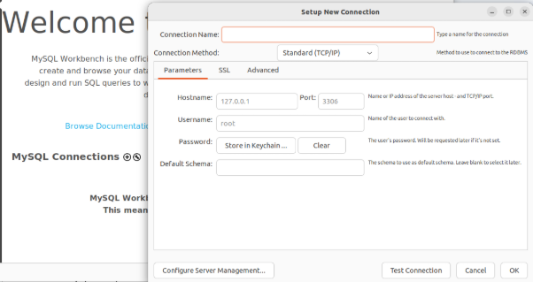
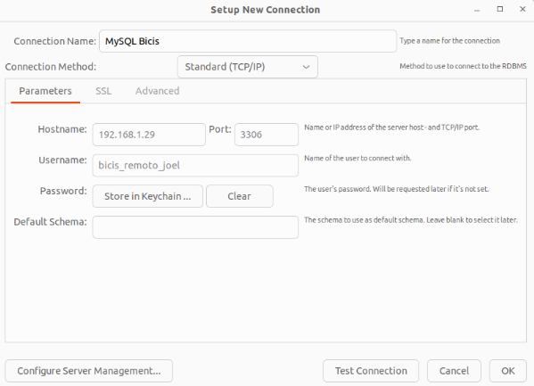
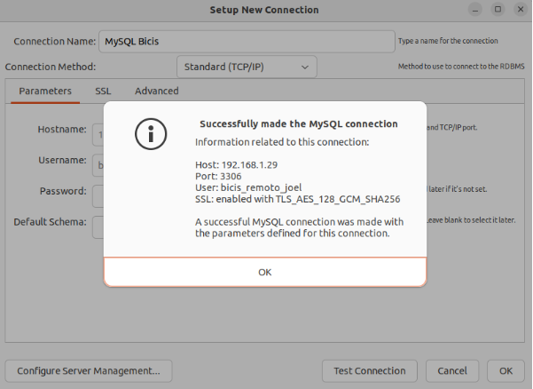
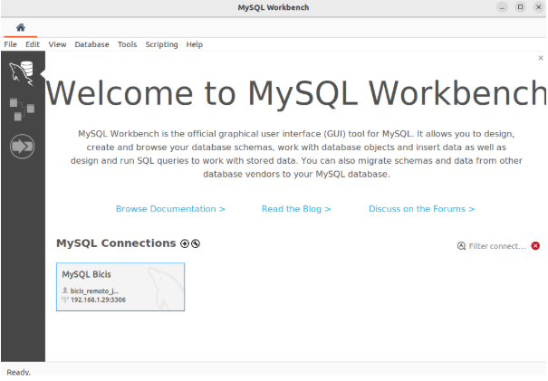
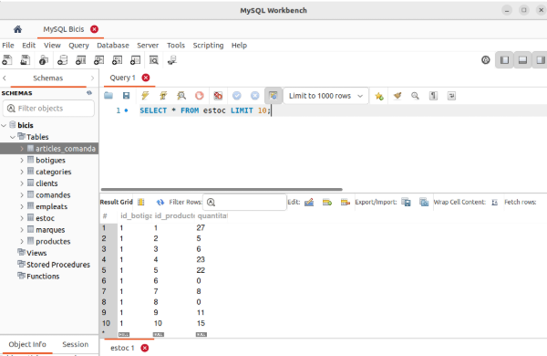
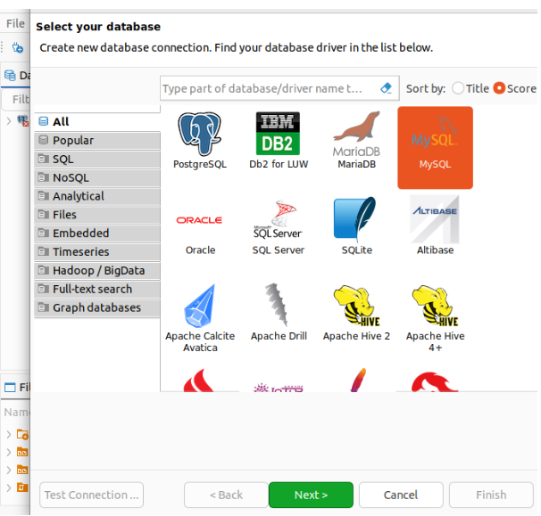
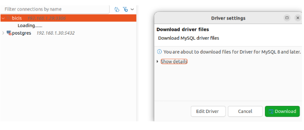
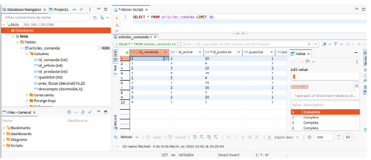

# MYSQL

---

## PRIMERA PARTE: INSTALACIÓN DE MYSQL

---

En esta nueva actividad vamos a realizar la instalación del servicio de MySQL con la misma M.Cliente que en las dos prácticas previas, y con una nueva M.Servidor.
Como en la primera práctica, en primer lugar vamos a cambiar el nombre predeterminado del host de la M.Servidor por uno que nos identifique con el siguiente comando:
```bash
isard@ubuntu-server:~$ sudo hostnamectl set-hostname jaguilera-server
```
Para poder ver el cambio de nombre deberemos reiniciar el servidor con:
```bash
isard@ubuntu-server:~$ reboot
isard@jaguilera:~$ 
```

### REPOSITORIOS

Gracias a los comandos de la página de Hostinger (enlace en el último apartado) vamos a instalar los repositorios necesarios. Pero previamente vamos a realizar el paso recomendable antes de hacer cualquier instalación:
```bash
isard@jaguilera:~$ sudo apt update && upgrade
Obj:1 http://de.archive.ubuntu.com/ubuntu noble InRelease
Des:2 http://de.archive.ubuntu.com/ubuntu noble-updates InRelease [126 kB]    
Des:3 http://de.archive.ubuntu.com/ubuntu noble-backports InRelease [126 kB]         
Des:4 http://de.archive.ubuntu.com/ubuntu noble-updates/main amd64 Packages [1.619 kB]
Des:5 http://de.archive.ubuntu.com/ubuntu noble-updates/main Translation-en [303 kB] 
Des:6 http://de.archive.ubuntu.com/ubuntu noble-updates/main amd64 Components [175 kB]                          
Des:7 http://de.archive.ubuntu.com/ubuntu noble-updates/main amd64 c-n-f Metadata [15,7 kB] 
…
```
Realizaremos la instalación con el comando: 
```bash
isard@jaguilera:~$ sudo apt install mysql-server
Leyendo lista de paquetes... Hecho
Creando árbol de dependencias... Hecho
Leyendo la información de estado... Hecho
El paquete indicado a continuación se instaló de forma automática y ya no es necesario.
  python3-debian
…
```
Y podemos verificar la versión instalada con:
```bash
isard@jaguilera:~$ mysql -V
mysql  Ver 8.0.44-0ubuntu0.24.04.1 for Linux on x86_64 ((Ubuntu))
```
O confirmar el estado del servicio con:
```bash
isard@jaguilera:~$ sudo systemctl status mysql
● mysql.service - MySQL Community Server
     Loaded: loaded (/usr/lib/systemd/system/mysql.service; enabled; preset: enabled)
     Active: active (running) since Tue 2025-11-25 17:55:50 UTC; 8min ago
    Process: 2192 ExecStartPre=/usr/share/mysql/mysql-systemd-start pre (code=exited, status=0/SUCCESS)
   Main PID: 2218 (mysqld)
     Status: "Server is operational"
      Tasks: 38 (limit: 7015)
     Memory: 363.9M (peak: 378.3M)
        CPU: 5.024s
     CGroup: /system.slice/mysql.service
             └─2218 /usr/sbin/mysqld

nov 25 17:55:47 jaguilera systemd[1]: Starting mysql.service - MySQL Community Server...
nov 25 17:55:50 jaguilera systemd[1]: Started mysql.service - MySQL Community Server.
```
Podemos accceder a mysql con:
```bash
isard@jaguilera:~$ sudo mysql
[sudo] password for isard: 
Welcome to the MySQL monitor.  Commands end with ; or \g.
Your MySQL connection id is 10
Server version: 8.0.44-0ubuntu0.24.04.1 (Ubuntu)
Copyright (c) 2000, 2025, Oracle and/or its affiliates.
Oracle is a registered trademark of Oracle Corporation and/or its
affiliates. Other names may be trademarks of their respective
owners.
Type 'help;' or '\h' for help. Type '\c' to clear the current input statement.
mysql>
```
Ahora creamos un espacio donde alojaremos la base de datos que hemos descargado “bicis_dump.sql” y accederemos a ella antes de cargar los datos:
```bash
mysql> create database bicis;
Query OK, 1 row affected (0,05 sec)
mysql> USE bicis;
Database changed
```
Y para cargar los datos, haremos uso de la orden “SOURCE”:
```bash
mysql> SOURCE /home/isard/DB/bicis_dump.sql
Query OK, 0 rows affected (0,00 sec)
Query OK, 0 rows affected (0,00 sec)
Query OK, 0 rows affected (0,00 sec)
Query OK, 0 rows affected (0,00 sec)
Query OK, 0 rows affected (0,00 sec)
Query OK, 0 rows affected (0,00 sec)
Query OK, 0 rows affected (0,00 sec)
Query OK, 0 rows affected (0,00 sec)
Query OK, 0 rows affected (0,00 sec)
Query OK, 0 rows affected (0,00 sec)
Query OK, 0 rows affected (0,01 sec)
```
Y ahora que está ya cargada, vamos a enseñar las tablas y algunos de los registros.
```bash
mysql> show tables;
+------------------+
| Tables_in_bicis  |
+------------------+
| articles_comanda |
| botigues         |
| categories       |
| clients          |
| comandes         |
| empleats         |
| estoc            |
| marques          |
| productes        |
+------------------+
9 rows in set (0,01 sec)
```
```bash
mysql> SELECT * FROM comandes LIMIT 10;
+------------+-----------+---------------+--------------+--------------+----------------+-----------+------------+
| id_comanda | id_client | estat_comanda | data_comanda | data_entrega | data_enviament | id_botiga | id_empleat |
+------------+-----------+---------------+--------------+--------------+----------------+-----------+------------+
|          1 |       259 | Completa      | 2016-01-01   | 2016-01-03   | 2016-01-03     |         1 |          2 |
|          2 |      1212 | Completa      | 2016-01-01   | 2016-01-04   | 2016-01-03     |         2 |          6 |
|          3 |       523 | Completa      | 2016-01-02   | 2016-01-05   | 2016-01-03     |         2 |          7 |
|          4 |       175 | Completa      | 2016-01-03   | 2016-01-04   | 2016-01-05     |         1 |          3 |
|          5 |      1324 | Completa      | 2016-01-03   | 2016-01-06   | 2016-01-06     |         2 |          6 |
|          6 |        94 | Completa      | 2016-01-04   | 2016-01-07   | 2016-01-05     |         2 |          6 |
|          7 |       324 | Completa      | 2016-01-04   | 2016-01-07   | 2016-01-05     |         2 |          6 |
|          8 |      1204 | Completa      | 2016-01-04   | 2016-01-05   | 2016-01-05     |         2 |          7 |
|          9 |        60 | Completa      | 2016-01-05   | 2016-01-08   | 2016-01-08     |         1 |          2 |
|         10 |       442 | Completa      | 2016-01-05   | 2016-01-06   | 2016-01-06     |         2 |          6 |
+------------+-----------+---------------+--------------+--------------+----------------+-----------+------------+
10 rows in set (0,01 sec)
```

----

## SEGUNDA PARTE: CLIENTE (terminal)

---

En este punto, igual que hicimos con PostgreSQL, vamos a hacer con MySQL. Vamos a simular una conexión externa, pero accediendo desde la misma máquina servidor.

Hasta ahora sólo hemos accedido al servicio con **sudo mysql** accediendo como root, por lo que lo primero que vamos a hacer es crear un usuario propio para trabajar con nuestra base de datos “bicis”.
Para ello, primero volveremos a acceder como root a MySQL y procederemos a crear el usuario para esa máquina servidor y para esa base de datos.
```bash
mysql> CREATE USER 'bicis_joel'@'localhost' IDENTIFIED BY 'bicis_joel';
Query OK, 0 rows affected (0,03 sec)
mysql> GRANT ALL PRIVILEGES ON bicis.* TO 'bicis_joel'@'localhost';
Query OK, 0 rows affected (0,02 sec)
mysql> FLUSH PRIVILEGES;
Query OK, 0 rows affected (0,03 sec)
mysql> EXIT;
Bye
```
Y ahora vamos a entrar con el usuario local y contraseña que hemos creado:
```bash
isard@jaguilera:~$ mysql -u bicis_joel -p
Enter password: 
Welcome to the MySQL monitor.  Commands end with ; or \g.
Your MySQL connection id is 10
Server version: 8.0.44-0ubuntu0.24.04.1 (Ubuntu)
Copyright (c) 2000, 2025, Oracle and/or its affiliates.
Oracle is a registered trademark of Oracle Corporation and/or its
affiliates. Other names may be trademarks of their respective
owners.
Type 'help;' or '\h' for help. Type '\c' to clear the current input statement.
mysql>
```
Procedemos a mostrar algunos registros…
```bash
mysql> USE bicis;
Reading table information for completion of table and column names
You can turn off this feature to get a quicker startup with -A
Database changed
```
```bash
mysql> SHOW tables;
+------------------+
| Tables_in_bicis  |
+------------------+
| articles_comanda |
| botigues         |
| categories       |
| clients          |
| comandes         |
| empleats         |
| estoc            |
| marques          |
| productes        |
+------------------+
9 rows in set (0,01 sec)
````
```bash
mysql> SELECT * FROM marques LIMIT 10;
+----------+--------------+
| id_marca | nom_marca    |
+----------+--------------+
|        1 | Electra      |
|        2 | Haro         |
|        3 | Heller       |
|        4 | Pure Cycles  |
|        5 | Ritchey      |
|        6 | Strider      |
|        7 | Sun Bicycles |
|        8 | Surly        |
|        9 | Trek         |
+----------+--------------+
9 rows in set (0,00 sec)
mysql> 
```
---

## TERCERA PARTE: CLIENTE REMOTO (MySQL Workbench)

---

En esta tercera parte vamos a acceder a MySQL con un cliente remoto desde la máquina cliente. Pero primero vamos a instalar la herramienta de MySQL Workbench, que es la herramienta oficial para administrar servidores de MySQL desde una interfaz gráfica.
Para ello, nos iremos a la terminal de nuestra máquina cliente y como siempre, actualizaremos los repositorios y luego instalaremos la herramienta.
```bash
alumne@jaguilera:~$ sudo apt update
[sudo] contrasenya per a alumne: 
Bai:1 http://apt.postgresql.org/pub/repos/apt jammy-pgdg InRelease [107 kB]
Obj:2 http://de.archive.ubuntu.com/ubuntu jammy InRelease                                                                                                                                                  
Bai:3 http://de.archive.ubuntu.com/ubuntu jammy-updates InRelease [128 kB]
…
```
```bash
alumne@jaguilera:~$ sudo snap install mysql-workbench-community
[sudo] contrasenya per a alumne: 
mysql-workbench-community 8.0.xx from Tonin Bolzan (tonybolzan) installed
Y ahora ya podríamos abrir la herramienta desde el menú de aplicaciones.
A continuación debemos configurar el servidor para permitir conexiones remotas.
```
```bash
isard@jaguilera:~$ sudo nano /etc/mysql/mysql.conf.d/mysqld.cnf
[sudo] password for isard:
```
Nos vamos a la línea donde marca:
```bash
# Instead of skip-networking the default is now to listen only on
# localhost which is more compatible and is not less secure.
bind-address            = 127.0.0.1
mysqlx-bind-address     = 127.0.0.1
```
Y lo cambiamos por **0.0.0.0** para que escuche desde cualquier IP, aunque podríamos configurarlo sólo por la IP de la máquina cliente. Pero dado que se trata de un entorno escolar y de pruebas, para no tener que configurarlo de nuevo por si perdemos la máquina cliente, lo dejaremos con la escucha abierta.
```bash
# Instead of skip-networking the default is now to listen only on
# localhost which is more compatible and is not less secure.
bind-address            = 0.0.0.0
mysqlx-bind-address     = 127.0.0.1
```
Y ahora reiniciamos el servicio y verificamos el estado.
```bash
isard@jaguilera:~$ sudo systemctl restart mysql
isard@jaguilera:~$ sudo systemctl status mysql
● mysql.service - MySQL Community Server
     Loaded: loaded (/usr/lib/systemd/system/mysql.service; enabled; preset: enabled)
     Active: active (running) since Tue 2025-12-02 18:15:13 UTC; 11s ago
    Process: 1155 ExecStartPre=/usr/share/mysql/mysql-systemd-start pre (code=exited, status=0/SUCCESS)
   Main PID: 1164 (mysqld)
     Status: "Server is operational"
      Tasks: 38 (limit: 7016)
     Memory: 365.7M (peak: 380.2M)
        CPU: 1.038s
     CGroup: /system.slice/mysql.service
             └─1164 /usr/sbin/mysqld

dic 02 18:15:11 jaguilera systemd[1]: Starting mysql.service - MySQL Community Server...
dic 02 18:15:13 jaguilera systemd[1]: Started mysql.service - MySQL Community Server.
```
El siguiente paso será el de crear un usuario para poder entrar con la máquina cliente, ya que previamente hemos creado un usuario pero sólo válido para conexiones locales **localhost**.
Accedemos como root al servicio MySQL desde la máquina servidor:
```bash
mysql> CREATE USER 'bicis_remoto_joel'@'192.168.1.31' IDENTIFIED BY 'bicis_remoto_joel';
Query OK, 0 rows affected (0,04 sec)
mysql> GRANT ALL PRIVILEGES ON bicis.* TO 'bicis_remoto_joel'@'192.168.1.31';
Query OK, 0 rows affected (0,01 sec)
mysql> FLUSH PRIVILEGES;
Query OK, 0 rows affected (0,01 sec)
```
> [!NOTE]
> Y como no tenemos el firewall de ubuntu activado en la máquina servidor, no tendremos que hacer nada, pero si este no fuera el caso, deberíamos abrir el puerto (3306) para MySQL aplicando estos comandos:
```bash
sudo ufw allow from 192.168.1.31 to any port 3306 proto tcp
```
```bash
sudo ufw reload
```
Y ahora ya podemos proceder a abrir MySQL WorkBench desde la máquina cliente.
Si hacemos clic en el **+**se nos abrirá la siguiente ventana.



Introducimos los siguientes datos y haciendo clic en **Password: Store in Keychain…** introducimos la contraseña y clic en **Test Connection*.




Le damos al **OK** y ahora en el menú principal ya nos aparece.



Si hacemos clic en la base de datos nos aparece el siguiente menú vacío. Con las flechas llegamos a **SCHEMAS** y ahí nos aparecerá nuestra base de datos. Desplegamos haciendo clic y aparecerán las tablas, y por último si hacemos una consulta y le damos al icono del **rayo** nos aparecerán debajo los registros demandados.



---

## CUARTA PARTE: CLIENTE (DBeaver)

---

Como la instalación de DBeaver ya la hicimos en la práctica anterior y estamos usando la misma máquina como cliente, para cualquiera que desee conocer cómo instalar la herramienta gráfica, puede consultar en el siguiente enlace: 
Ahora que ya hemos abierto la herramienta vamos a configurar la conexión con MySQL y la base de datos **bicis**.



Escribimos la dirección IP de la máquina servidor, el nombre de la base de datos a la que queremos acceder, el usuario con el que queremos conectar y su contraseña.




Y una vez se ha establecido la conexión ya podremos hacer consultas a las tablas de la base de datos.



---

## QUINTA PARTE: PREGUNTAS

### 1. ¿Consideras MySQL un SGBD centralizado o un sistema basado en cliente/servidor? Argumenta tu respuesta.

Igual que con PostgreSQL, nos encontramos que MySQL sigue una arquitectura cliente/servidor. 

En este caso instalamos mysql-server en la máquina servidor, y ésta escuchará las peticiones para que clientes conecten y hagan sus peticiones, como nuestro cliente a través de la termianl o de interfaces gráficas como MySQL Workbench o DBeaver.

### 2. Si has categorizado MySQL como un sistema cliente/servidor, ¿en qué tipo de arquitectura por capas crees que encaja mejor: en 2 capas o en 3 capas? Argumenta tu respuesta.

MySQL, al igual que PostgreSQL, podríamos considerarlo como un sistema de 3 capas:

Capa del cliente o de presentación: Es la que interactúa con el usuario ya que se le muestra la información y es donde se reflejan las propias acciones. Por ejemplo, podría ser la herramienta de DBeaver o un mismo cliente por terminal con mysql -u -p.
Capa del servidor o de base de datos: Es la que actúa como almacenamiento de los datos y quien recibe las consultas SQL y gestiona los datos para devolver los resultados. En este caso, sería MySQL-server.
Capa SQL o de lenguaje de consulta: Es la que emplea SQL como el intermediario o traductor entre las otras dos capas. Es decir, es el medio a través del cual el cliente se comunica con el servidor de la base de datos.

### 3. ¿Puedes hacer una comparativa entre esta práctica y la versión de PostgreSQL? ¿Qué similitudes has encontrado? ¿Qué diferencias?

Ambas prácticas siguen la misma estructura y son súper similares a la hora de instalar y configurar (obviamente cada servicio con sus respectivos archivos de configuración), aunque MySQL me ha resultado más sencillo e intuitivo que PostgreSQL.

En ambos casos hemos instalado un servidor de bases de datos que funciona con la arquitectura cliente/servidor y en ambas hemos restaurado una base de datos externa. También hemos entrado con un usuario que simulaba entrar de manera remota pero desde la misma máquina servidor, y de manera remota desde una máquina cliente, a través de la terminal y de herramientas que permiten la conexión mediante un entorno gráfico. (Aunque aquí a diferencia de pgadmin4 hemos usado MySQL Workbench)

En general es bastante similar, aunque la línea de comandos de MySQL me resulta más sencilla e intuitiva en todos los sentidos. Quizás se deba a que ya la había empleado previamente en el curso pasado, pero hasta a la hora de mostrar/usar una base de datos o mostrar tablas me resulta más intuitivo el comando que en PostgreSQL.

---

## ENLACES DE INTERÉS Y CONSULTA

---

https://www.hostinger.com/tutorials/how-to-install-mysql-ubuntu?utm_campaign=Generic-Tutorials-DSA-t1|NT:Se|Lang:EN|LO:ES&utm_medium=ppc&gad_source=1&gad_campaignid=20592453563&gclid=EAIaIQobChMI5a7yle2NkQMVMkJBAh1-aASUEAAYASAAEgJgB_D_BwE
https://dev.mysql.com/doc/workbench/en/wb-installing-linux.html 
https://en.ubunlog.com/mysql-workbench-snap-package-installation/
https://www.ochobitshacenunbyte.com/2019/03/27/como-instalar-dbeaver-en-ubuntu-18-04/
