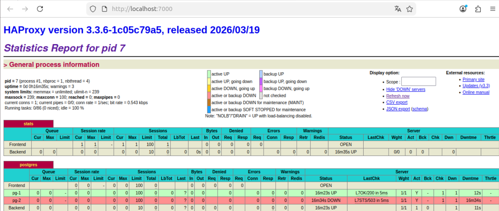
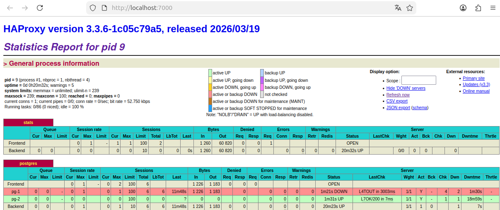

# ALTA DISPONIBILIDAD CON POSTGRESQL

---

En esta nueva práctica vamos a orquestar un escenario en el que trabajaremos la alta disponibilidad de una base de datos en PostgreSQL gracias a un conjunto de piezas esenciales que lo van a hacer posibles.

El objetivo es crear un escenario en el que cuando una base de datos alojada en un servidor caiga, otra base de datos, salga en su rescate a modo de sustitución hasta que la base de datos caída se recupere. Es por tanto una actividad de demostración de alta disponibilidad en las bases de datos.

Dichas piezas son un conjunto de tecnologías diferentes:

- PostgreSQL 
Será nuestro motor de base de datos y por tanto quien almacenará los datos.

- Patroni
Es la pieza central de la alta disponibilidad. Patroni automatiza la gestión de PostgreSQL en clúster. Es decir, le indicamos bajo nuestra elección quien es el líder, como se promocionan las réplicas, y se encarga de hacer reinicios controlados y consultas de estado.

- etcd
Es el almacén distribuido de configuración/consenso que Patroni usa como Sistema de Control Distribuido. Es ahí donde se guarda quién tiene el liderazgo y metadatos del clúster.

- HAProxy
Es quien hace de punto de entrada único. Es decir, el cliente se conecta siempre al mismo puerto 5432 del host, y HAProxy decide internamente a qué nodo enviarlo según los checks que hace contra Patroni. También expone estadísticas web en el puerto 7000.

- Docker Compose
Es quien empaquetará y levantará toda la práctica de forma repetible, con la misma red, mismos nombres, mismos volúmenes y mismo arranque en cualquier máquina compatible.

---

## MONTAJE DEL ESCENARIO

---

Explicadas las piezas principales de la primera parte de la práctica, vamos a empezar a montar el escenario.
Cabe destacar que vamos a usar una máquina virtualizada con la distribución de Ubuntu Desktop 24.04 en VirtualBox.

Una vez iniciada nuestra máquina, el primer paso será instalar Docker Compose con el comando:

```bash
joel-docker-asgbd@0:~$ sudo apt install docker.io docker-compose-v2 -y
[sudo] contraseña para joel-docker-asgbd: 
Leyendo lista de paquetes... Hecho
Creando árbol de dependencias... Hecho
Leyendo la información de estado... Hecho
```

Verificamos la instalación mirando la versión del docker.

```bash
joel-docker-asgbd@0:~$ sudo docker version
Client:
 Version:           28.2.2
 API version:       1.50
 Go version:        go1.23.1
 Git commit:        28.2.2-0ubuntu1~24.04.1
 Built:             Wed Sep 10 14:16:39 2025
 OS/Arch:           linux/amd64
 Context:           default

Server:
 Engine:
  Version:          28.2.2
  API version:      1.50 (minimum version 1.24)
  Go version:       go1.23.1
  Git commit:       28.2.2-0ubuntu1~24.04.1
  Built:            Wed Sep 10 14:16:39 2025
  OS/Arch:          linux/amd64
  Experimental:     false
 containerd:
  Version:          1.7.28
  GitCommit:        
 runc:
  Version:          1.3.3-0ubuntu1~24.04.3
  GitCommit:        
 docker-init:
  Version:          0.19.0
  GitCommit:        
```
```bash
joel-docker-asgbd@0:~$ sudo docker compose version
Docker Compose version 2.37.1+ds1-0ubuntu2~24.04.1
```
Ahora vamos a crear el directorio donde crearemos y guardaremos los archivos pilares de la actividad (los que se nos han compartido en el enunciado).

```bash
joel-docker-asgbd@0:~$ mkdir ha-postgresql
joel-docker-asgbd@0:~$ cd ha-postgresql/
joel-docker-asgbd@0:~/ha-postgresql$ ~/ha-postgresql$ 
```
Una vez dentro del directorio haremos la creación de los archivos y copiaremos dentro de cada uno las líneas que se nos han compartido.

### DOCUMENTO DOCKERFILE

- Documento **Dockerfile**. Este archivo es el que construye la imagen de Docker para los contenedores de PostgreSQL y Patroni con todos los paquetes necesarios. Es decir, es el documento que da las instrucciones para crear el contenedor que incluya ambas tecnologías. 

```bash
joel-docker-asgbd@0:~/ha-postgresql$ sudo nano Dockerfile
```
Con este contenido:

```bash
FROM postgres:15-bullseye

USER root

RUN apt-get update && \
    apt-get install -y patroni python3-etcd curl && \
    rm -rf /var/lib/apt/lists/*

USER postgres

CMD ["patroni", "/patroni.yml"]
```

### DOCUMENTO PATRONI.YML

- Documento **patroni.yml**. Este es el archivo de configuración de Patroni, el cual le indica cómo gestionar el clúster de PostgreSQL. En pocas palabras, es el que define cómo se comunican entre sí los contenedores, qué usuario y contraseña usar, y cómo controlar el clúster.

```bash
joel-docker-asgbd@0:~/ha-postgresql$ sudo nano patroni.yml
```
Con este contenido:

```bash
scope: mi_cluster_ha
namespace: /db/
restapi:
  listen: 0.0.0.0:8008
etcd:
  host: etcd:2379
bootstrap:
  dcs:
    ttl: 30
    loop_wait: 10
    retry_timeout: 10
    maximum_lag_on_failover: 1048576
    postgresql:
      use_pg_rewind: true
  initdb:
    - auth-host: scram-sha-256
    - auth-local: trust
    - encoding: UTF8
  users:
    admin:
      password: joeadmin
      options:
        - createrole
        - createdb
postgresql:
  listen: 0.0.0.0:5432
  data_dir: /var/lib/postgresql/data/patroni
  pg_hba:
    - host replication joereplicador all scram-sha-256
    - host all all all scram-sha-256
  authentication:
    replication:
      username: joereplicador
      password: joereplicadorpassw
    superuser:
      username: postgres
      password: joeadmin
```

### DOCUMENTO HAPROXY.CFG

- Documento **haproxy.cfg**. Este archivo configura HAProxy para dirigir el tráfico a los nodos de PostgreSQL de forma correcta, según el estado en el que se encuentre. Si ese nodo falla, entonces redirige automáticamente al nodo secundario.

```bash
joel-docker-asgbd@0:~/ha-postgresql$ sudo nano haproxy.cfg
```

Con este contenido:

```bash
global
    maxconn 100

defaults
    log global
    mode tcp
    retries 2
    timeout client 30m
    timeout connect 4s
    timeout server 30m
    timeout check 5s

listen stats
    mode http
    bind *:7000
    stats enable
    stats uri /

listen postgres
    bind *:5432
    option httpchk GET /primary
    http-check expect status 200

    default-server inter 3s fall 3 rise 2 on-marked-down shutdown-sessions

    server pg-1 pg-1:5432 maxconn 100 check port 8008
    server pg-2 pg-2:5432 maxconn 100 check port 8008
```

### DOCUMENTO DOCKER-COMPOSE.YML

- Documento **docker-compose.yml**. Este archivo es el que se encarga de orquestar los contenedores con Docker Compose. Es decir, define los contenedores y las redes que Docker debe gestionar y levantar.

```bash
joel-docker-asgbd@0:~/ha-postgresql$ sudo nano docker-compose.yml
```

Con este contenido:

```bash
networks:
  ha-net:
    driver: bridge

services:
  # Etcd
  etcd:
    image: quay.io/coreos/etcd:v3.5.9
    container_name: etcd
    networks:
      - ha-net
    environment:
      - ETCD_LISTEN_CLIENT_URLS=http://0.0.0.0:2379
      - ETCD_ADVERTISE_CLIENT_URLS=http://etcd:2379
      - ETCD_ENABLE_V2=true

  # Node 1
  pg-1:
    build: .
    container_name: pg-1
    networks:
      - ha-net
    volumes:
      - ./patroni.yml:/patroni.yml:ro
      - pg_1_data:/var/lib/postgresql/data
    environment:
      - PATRONI_NAME=pg-1
      - PATRONI_RESTAPI_CONNECT_ADDRESS=pg-1:8008
      - PATRONI_POSTGRESQL_CONNECT_ADDRESS=pg-1:5432
    depends_on:
      - etcd

  # Node 2
  pg-2:
    build: .
    container_name: pg-2
    networks:
      - ha-net
    volumes:
      - ./patroni.yml:/patroni.yml:ro
      - pg_2_data:/var/lib/postgresql/data
    environment:
      - PATRONI_NAME=pg-2
      - PATRONI_RESTAPI_CONNECT_ADDRESS=pg-2:8008
      - PATRONI_POSTGRESQL_CONNECT_ADDRESS=pg-2:5432
    depends_on:
      - etcd

  # HAproxy
  haproxy:
    image: haproxy:alpine
    container_name: haproxy
    ports:
      - "5432:5432"
      - "7000:7000"
    networks:
      - ha-net
    volumes:
      - ./haproxy.cfg:/usr/local/etc/haproxy/haproxy.cfg:ro
    depends_on:
      - pg-1
      - pg-2

volumes:
  pg_1_data:
  pg_2_data:
```
---

Ahora que ya tenemos los documentos pilares, vamos a proceder con el levantamiento de la estructura.

Para ello ejecutaremos…

```bash
joel-docker-asgbd@0:~/ha-postgresql$ sudo docker compose up -d --build
[+] Running 22/22
 ✔ etcd Pulled                                                                  10.5s 
   ✔ dd5ad9c9c29f Pull complete                                                  1.8s 
   ✔ 960043b8858c Pull complete                                                  1.9s 
   ✔ b4ca4c215f48 Pull complete                                                  5.4s 
   ✔ eebb06941f3e Pull complete                                                  5.5s 
   ✔ 02cd68c0cbf6 Pull complete                                                  5.6s 
   ✔ d3c894b5b2b0 Pull complete                                                  5.7s 
…
```

Más abajo nos saldrá lo que se ha iniciado…

```bash
+] Running 9/9
 ✔ pg-1                              Built                                       0.0s 
 ✔ pg-2                              Built                                       0.0s 
 ✔ Network ha-postgresql_ha-net      Created                                     0.3s 
 ✔ Volume "ha-postgresql_pg_1_data"  Creat...                                    0.0s 
 ✔ Volume "ha-postgresql_pg_2_data"  Creat...                                    0.0s 
 ✔ Container etcd                    Started                                     1.7s 
 ✔ Container pg-2                    Started                                     2.6s 
 ✔ Container pg-1                    Started                                     2.5s 
 ✔ Container haproxy                 Started                                     3.5s 
```

Y esto hará que se construya la imagen de PostgreSQL y Patroni, junto con la red propia de Docker y a la vez levantará **etcd**. **pg-1**, **pg-2** y **HAProxy**.

Verificamos que esté funcionando con:

```bash
joel-docker-asgbd@0:~/ha-postgresql$ sudo docker compose ps
NAME      IMAGE                        COMMAND                  SERVICE   CREATED         STATUS         PORTS
etcd      quay.io/coreos/etcd:v3.5.9   "/usr/local/bin/etcd"    etcd      6 minutes ago   Up 6 minutes   2379-2380/tcp
haproxy   haproxy:alpine               "docker-entrypoint.s…"   haproxy   6 minutes ago   Up 6 minutes   0.0.0.0:5432->5432/tcp, [::]:5432->5432/tcp, 0.0.0.0:7000->7000/tcp, [::]:7000->7000/tcp
pg-1      ha-postgresql-pg-1           "docker-entrypoint.s…"   pg-1      6 minutes ago   Up 6 minutes   5432/tcp
pg-2      ha-postgresql-pg-2           "docker-entrypoint.s…"   pg-2      6 minutes ago   Up 6 minutes   5432/tcp
```
Y efectivamente en el **status** nos aparece como **up** desde hace unos minutos.

El próximo paso será el de ver el estado del clúster tal y como se nos ha solicitado.

Con el comando:

```bash
joel-docker-asgbd@0:~/ha-postgresql$ sudo docker exec -it pg-1 patronictl -c /patroni.yml list
+ Cluster: mi_cluster_ha (7620898151816511509) ----------+-----+------------+-----+
| Member | Host | Role    | State     | TL | Receive LSN | Lag | Replay LSN | Lag |
+--------+------+---------+-----------+----+-------------+-----+------------+-----+
| pg-1   | pg-1 | Leader  | running   |  1 |             |     |            |     |
| pg-2   | pg-2 | Replica | streaming |  1 |   0/304B540 |   0 |  0/304B540 |   0 |
+--------+------+---------+-----------+----+-------------+-----+------------+-----+
```
Veremos quién es el **leader** y quien es la **réplica**.

Y si vamos al navegador podremos abrir el panel de HAProxy escribiendo en la URL lo siguiente: **http://localhost:7000**.



Desde aquí podremos ver qué nodos están levantados y cuáles no.

---

## DEMOSTRACIÓN

---

Ahora vamos a hacer una comprobación de funcionamiento, creando un dato como cliente en postgresql y viendo si los datos se conservan si cae el servidor líder y salta a sustituirlo el que era réplica.

Pero primero deberemos instalar el cliente de postgresql para insertar algún dato.

```bash
joel-docker-asgbd@0:~$ sudo apt install postgresql-client
Leyendo lista de paquetes... Hecho
Creando árbol de dependencias... Hecho
Leyendo la información de estado... Hecho
Se instalarán los siguientes paquetes adicionales:
  libpq5 postgresql-client-16
```
Entramos con el usuario postgres y la contraseña que hemos configurado anteriormente.

```bash
joel-docker-asgbd@0:~$ psql -h 127.0.0.1 -p 5432 -U postgres
Password for user postgres: 
psql (16.13 (Ubuntu 16.13-0ubuntu0.24.04.1), server 15.13 (Debian 15.13-1.pgdg110+1))
Type "help" for help.

postgres=# 
```

Creamos una base de datos, una tabla y algún registro simplemente para hacer la prueba.

```bash
postgres=# CREATE DATABASE funciona_o_funciona;
CREATE DATABASE
postgres=# CREATE TABLE prueba (
id SERIAL PRIMARY KEY,
mensaje TEXT
);

INSERT INTO prueba (mensaje) VALUES ('sí que va a funcionar');
CREATE TABLE
INSERT 0 1
postgres=# 
```

Y ahora vamos a derrocar al líder parando el servicio.

```bash
joel-docker-asgbd@0:~$ sudo docker stop pg-1
pg-1
```

Y vamos a mirar el estado del clúster preguntándole a patroni, que deberá pasar de este estado:

```bash
joel-docker-asgbd@0:~$ sudo docker exec -it pg-1 patronictl -c /patroni.yml list
+ Cluster: mi_cluster_ha (7620898151816511509) ----------+-----+------------+-----+
| Member | Host | Role    | State     | TL | Receive LSN | Lag | Replay LSN | Lag |
+--------+------+---------+-----------+----+-------------+-----+------------+-----+
| pg-1   | pg-1 | Leader  | running   |  2 |             |     |            |     |
| pg-2   | pg-2 | Replica | streaming |  2 |   0/3499EC0 |   0 |  0/3499EC0 |   0 |
+--------+------+---------+-----------+----+-------------+-----+------------+-----+
```

A este otro estado:

```bash
joel-docker-asgbd@0:~$ sudo docker exec -it pg-2 patronictl -c /patroni.yml list+ Cluster: mi_cluster_ha (7620898151816511509) -------+-----+------------+-----+
| Member | Host | Role   | State   | TL | Receive LSN | Lag | Replay LSN | Lag |
+--------+------+--------+---------+----+-------------+-----+------------+-----+
| pg-2   | pg-2 | Leader | running |  3 |             |     |            |     |
+--------+------+--------+---------+----+-------------+-----+------------+-----+
```

Si miramos en HAProxy nos aparecerá también como **DOWN** a diferencia de **UP** como pasará con pg-2.



Y ahora si nos volvemos a conectar a postgresql deberíamos de seguir pudiendo ver los datos de la tabla.

```bash
joel-docker-asgbd@0:~$ psql -h 127.0.0.1 -p 5432 -U postgres
Password for user postgres: 
psql (16.13 (Ubuntu 16.13-0ubuntu0.24.04.1), server 15.13 (Debian 15.13-1.pgdg110+1))
Type "help" for help.

postgres=# SELECT * FROM prueba;
 id |        mensaje        
----+-----------------------
  1 | sí que va a funcionar
(1 row)
```

Si ahora lo volvemos a levantar el nodo, debería de volver pero en calidad de réplica.

```bash
joel-docker-asgbd@0:~$ sudo docker start pg-1
pg-1
```
```bash
joel-docker-asgbd@0:~$ sudo docker exec -it pg-1 patronictl -c /patroni.yml list
+ Cluster: mi_cluster_ha (7620898151816511509) ----------+-----+------------+-----+
| Member | Host | Role    | State     | TL | Receive LSN | Lag | Replay LSN | Lag |
+--------+------+---------+-----------+----+-------------+-----+------------+-----+
| pg-1   | pg-1 | Replica | streaming |  3 |   0/34A2080 |   0 |  0/34A2080 |   0 |
| pg-2   | pg-2 | Leader  | running   |  3 |             |     |            |     |
+--------+------+---------+-----------+----+-------------+-----+------------+-----+
```

Efectivamente, los podemos ver, y eso demuestra que aún habiendo caído el primer nodo, el segundo ha salido al rescate a sustituirlo para que se pueda seguir trabajando. Y si se reincorpora, el servidor vuelve como nuevo sustituto del que ahora es líder. En resumen, en esto consiste la alta disponibilidad.
